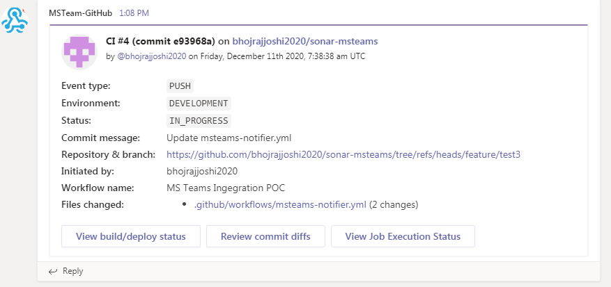
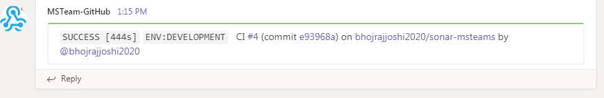
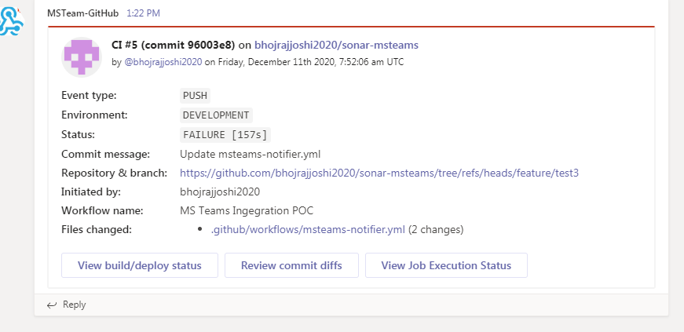

# MS Teams Integration with GiHub Actions workflow test1

This is a POC code to demostrate how notifications are sent to MS Teams in different stages (start, success and/or failure) of a workflow. We are using a community package **toko-bifrost/ms-teams-deploy-card** to achieve this. This document describes how to integrate this package in our workflow and required configuration for the same.

For more information:
- MS Teams Deploy Card package: https://github.com/toko-bifrost/ms-teams-deploy-card
- Creating MS Teams ingress webhook: https://docs.microsoft.com/en-us/microsoftteams/platform/webhooks-and-connectors/how-to/connectors-using

## Setting up a custom incoming webhook in MS Teams:

1. In Microsoft Teams, choose More options (⋯) next to the channel name and then choose Connectors.
2. Scroll through the list of Connectors to Incoming Webhook, and choose Add.
3. Enter a name for the webhook, upload an image to associate with data from the webhook, and choose Create.
4. Copy the webhook to the clipboard and save it. You'll need the webhook URL for sending information to Microsoft Teams.
5. Choose Done.

## Configuring the deploy card package in the workflow

1. Add MSTEAMS_WEBHOOK on your repository's configs on Settings > Secrets. It is the webhook URI of the dedicated Microsoft Teams channel for notification created in the above steps.
2. Add GIT_TOKEN on your repository's configs on Settings > Secrets. It is the Personal access token generated from you Profile > Settings > Developer Settings.
2. Add a new step on your workflow code below actions/checkout@v2:
```
- name: GitHub Pipeline Status Alert
        uses: toko-bifrost/ms-teams-deploy-card@3.1.2
        with:
          github-token: ${{ secrets.GIT_TOKEN }}
          webhook-uri: ${{ secrets.MSTEAMS_WEBHOOK }}
          card-layout-start: complete
          card-layout-exit: complete
          show-on-start: true
          show-on-exit: true
          environment: development
          custom-facts: |
            - name: Initiated by
              value: ${{ github.actor }}
            - name: Workflow name
              value: ${{ github.workflow }}
          custom-actions: |
            - text: View Job Execution Status
              url: "https://github.com/${{ github.repository }}/actions/runs/${{ github.run_id }}"
```

## Sample MS Teams Cards published to a channel
Once the workflow runs as configured, it will send the very first alert to the channel that looks like below:



Depending upon the success or failure of the job, the below card will be displayed on the challel.

### Success card (compact)



### Failure card (complete)


